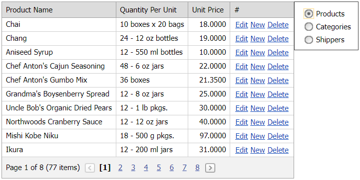

<!-- default badges list -->

<!-- default badges end -->

# Grid View for ASP.NET Web Forms - How to create columns and bind the control to different data sources at runtime
<!-- run online -->
**[[Run Online]](https://codecentral.devexpress.com/e2967/)**
<!-- run online end -->

This example demonstrates how to create columns and bind the [ASPxGridView](https://docs.devexpress.com/AspNet/DevExpress.Web.ASPxGridView) to different data sources at runtime. Select items in the [ASPxRadioButtonList](https://docs.devexpress.com/AspNet/DevExpress.Web.ASPxRadioButtonList) control to switch between [SQL data sources](https://docs.microsoft.com/en-us/dotnet/api/system.web.ui.webcontrols.sqldatasource?view=netframework-4.8).

The grid does not have columns in design mode. All columns are added to the grid at runtime according to columns of the bound data source. If the data source has the [insert](https://docs.microsoft.com/en-us/dotnet/api/system.web.ui.webcontrols.sqldatasource.insertcommand?view=netframework-4.8), [update](https://docs.microsoft.com/en-us/dotnet/api/system.web.ui.webcontrols.sqldatasource.updatecommand?view=netframework-4.8), or [delete](https://docs.microsoft.com/en-us/dotnet/api/system.web.ui.webcontrols.sqldatasource.deletecommand?view=netframework-4.8) command, the grid displays the [command column](https://docs.devexpress.com/AspNet/3701/components/grid-view/concepts/data-representation-basics/columns/command-columns?p=netframework).

Note that the grid's [EnableViewState](https://docs.microsoft.com/en-us/dotnet/api/system.web.ui.control.enableviewstate#System_Web_UI_Control_EnableViewState) property is set to `false` to avoid exceptions when binding the grid to a data source.

## Files to Look At

* [Default.aspx](./CS/WebSite/Default.aspx)
* [Default.aspx.cs](./CS/WebSite/Default.aspx.cs)

## Documentation

* [Bind Grid View to Data at Runtime](https://docs.devexpress.com/AspNet/403612/components/grid-view/concepts/bind-to-data/bind-to-data-at-runtime)
* [Creating Columns and Binding Them to Data Fields](https://docs.devexpress.com/AspNet/3698/components/grid-view/concepts/data-representation-basics/columns/creating-columns-and-binding-them-to-data-fields)

## More Examples

* [Grid View for ASP.NET Web Forms - How to dynamically switch the Grid's data source and recreate columns at runtime](https://www.devexpress.com/Support/Center/p/E448)
* [Grid View for ASP.NET Web Forms - How to bind the control with autogenerated columns to different data sources at runtime](https://www.devexpress.com/Support/Center/p/E2965)
* [Grid View for ASP.NET Web Forms - How to create the control and bind it to different data sources at runtime ](https://www.devexpress.com/Support/Center/p/E2968)
